# 1. INTRODUCTION

## 1.1 Purpose

The purpose of this project is to develop a digital check-in and payment system for campus events that seamlessly integrates with the university’s student identification database and a secure payment gateway. The system aims to automate event attendance through student ID verification and ticket validation, reducing manual processes and human error.

Additionally, it enables secure on-site purchases—such as food, merchandise, and services—and equips event organizers with real-time analytics and reports to improve event management. Ultimately, the system enhances operational efficiency, security, and user experience for both students and staff.

## 1.2 Scope

The system allows students and vendors to check in to events via QR code, providing a streamlined and user-friendly experience. Key features include real-time notifications, integrated payment processing, and an event rating mechanism. The system does not include support for mapping, third-party navigation systems, or outdoor location services.

## 1.3 Product Overview

The digital check-in system is designed to manage campus event attendance and transactions efficiently. It enables students to check in using their university-issued IDs and supports both digital and physical ticket validation. The system interfaces with the university’s student database for real-time identity verification and with payment gateways for secure transactions.

Admin users can oversee events, monitor attendance, manage ticketing, and access comprehensive reports. The platform is intended for use by students, vendors, and administrators.

---
### 1.3.1 Product Perspective
The Campus Check-in System operates as a centralized event management platform that interacts with multiple user roles and external systems. The system interfaces with:

- **Students**, who can log in, register for events, view event details, and make payments.
- **Vendors**, who accept payments and view sales data.
- **Admins**, who manage events, monitor attendance, approve vendor access, and generate reports.
- **External systems**, including:
  - University student database for verification,
  - Online payment gateways for transaction processing,
  - Analytics modules for report generation.

This interaction is illustrated in **Figure 1**, which shows the high-level context of the system and its key data exchanges.

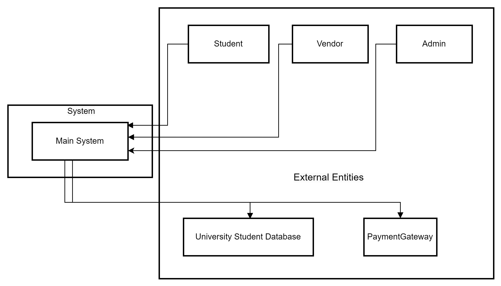

### 1.3.2 Product Functions

| **Function**                     | **Description**                                                                                                                                         |
|----------------------------------|---------------------------------------------------------------------------------------------------------------------------------------------------------|
| **Student Check-in**            | Allows students to check in to events using their university ID cards or student numbers.                                                               |
| **Ticket Verification**         | Validates tickets during entry to ensure that only authorized participants are admitted.                                                               |
| **Payment Processing**          | Enables secure on-site purchases (e.g., food, merchandise) through integration with payment gateways.                                                  |
| **Real-time Attendance Tracking** | Records attendance as students check in and provides up-to-date data to the admin interface.                                                           |
| **Student Database Integration** | Connects to the university’s identification database for real-time verification of student status.                                                     |
| **Analytics and Reports**       | Generates post-event reports including attendance logs, transaction summaries, and ticket scan histories for students and vendors.                     |

*Table 1. Key product functions of the Campus Check-in System*

---

### 1.3.3 User Characteristics

| *Role*   | *Description*                                                                                 | *Required Knowledge*                                                                                       |
|-----------|--------------------------------------------------------------------------------------------------|--------------------------------------------------------------------------------------------------------------|
| *Student* | University students using the system to check in and make purchases at events.                   | Basic familiarity with mobile or web-based applications.                                                     |
| *Admin*   | Staff responsible for managing events, tracking attendance, and accessing reports.               | Familiarity with admin dashboards, event management tools, and reporting interfaces.                         |
| *Vendor*  | On-site service providers (e.g., food or merchandise vendors) using the system to process transactions and monitor sales. | Basic understanding of digital payment platforms and ability to navigate the vendor interface. |

Table 2. User roles and required competencies

### 1.3.4 Limitations

- **Dependence on Internet Connectivity**: The system requires a stable internet connection for real-time check-ins, payment processing, and data synchronization.
- **Scalability Constraints**: Performance may degrade in large-scale events without proper server infrastructure.
- **Lack of Offline Support**: Version 1.0 does not support offline operations, including check-in and payment processing.
- **User Training Needs**: Admins and vendors may require minimal training to operate the system efficiently and avoid errors.
- **Device Compatibility**: Admins and vendors must use compatible tablets or laptops; inadequate hardware could hinder functionality.

---

### 1.4 Definitions

| **Term**             | **Definition**                                                                                          |
|----------------------|----------------------------------------------------------------------------------------------------------|
| **Integration**      | The process of linking the system with external platforms such as databases and payment gateways.        |
| **Analytics**        | Data analysis activities aimed at extracting insights, such as user activity or attendance patterns.      |
| **On-site Purchases**| Purchases made at the event location (e.g., food, merchandise).                                           |
| **Payment Gateway**  | A service that securely processes digital payments such as credit/debit card transactions.               |
| **Check-in System**  | A digital tool used to verify participant presence at events.                                             |
| **Ticket Verification** | The validation process that determines whether an event ticket is genuine and valid.                 |
| **End Users**        | Individuals interacting directly with the system (students, admins, vendors).                            |
| **Backend**          | The server-side logic and infrastructure that supports data processing, storage, and core functionality. |

*Table 3. Glossary of key terms*

## 3. Requirements

### 3.1 External Interfaces

This section defines the external interface requirements of the Campus Event Check-In System.  
It describes the user-facing actions and the corresponding inputs and outputs expected in each interaction. The interface elements are designed to offer a seamless and user-friendly experience, while ensuring secure and efficient communication with external components such as the university’s student database, integrated payment systems, and QR scanning tools. These interfaces serve as the connection point between users and the system’s core functionalities.

---

### 3.1.1 Login

Tables below define the interface components used in the login user interface.

#### `REQ_IO0001` - Login Button (Input)

| **Field**        | **Detail**                                                            |
|------------------|------------------------------------------------------------------------|
| **Version**      | 1.0                                                                    |
| **Item**         | Login Button (Input)                                                   |
| **Description**  | A button labeled “Login”                                               |
| **Purpose**      | Submits login credentials for authentication                          |
| **Input Format** | Button                                                                 |
| **Valid Input**  | Not Applicable                                                         |
| **Related I/O**  | REQ_IO00002, REQ_IO0003 (Both fields must be filled)                   |
| **Author**       | Suliman                                                                |

#### `REQ_IO0002` - Student ID Field (Input)

| **Field**        | **Detail**                                                 |
|------------------|-------------------------------------------------------------|
| **Version**      | 1.0                                                         |
| **Item**         | Student ID Field (Input)                                    |
| **Description**  | A text field labeled “Student ID”                           |
| **Purpose**      | Allows users to enter their Student ID                      |
| **Input Format** | String                                                      |
| **Valid Input**  | ASCII code from decimal 32 to 126                           |
| **Related I/O**  | None                                                        |
| **Author**       | Suliman                                                     |

#### `REQ_IO0003` - Password Field (Input)

| **Field**        | **Detail**                                                 |
|------------------|-------------------------------------------------------------|
| **Version**      | 1.0                                                         |
| **Item**         | Password Field (Input)                                      |
| **Description**  | A text field labeled “Password”                             |
| **Purpose**      | Allows users to enter their password                        |
| **Input Format** | String                                                      |
| **Valid Input**  | ASCII code from decimal 32 to 126                           |
| **Related I/O**  | None                                                        |
| **Author**       | Suliman                                                     |

#### `REQ_IO0004` - Failure Message (Output)

| **Field**        | **Detail**                                                 |
|------------------|-------------------------------------------------------------|
| **Version**      | 1.0                                                         |
| **Item**         | Failure Message (Output)                                    |
| **Description**  | Toast message for login failure                             |
| **Purpose**      | Notifies users of incorrect login                           |
| **Input Format** | Not Applicable                                              |
| **Valid Input**  | Not Applicable                                              |
| **Related I/O**  | REQ_IO0001 (Only displayed after submission)                |
| **Author**       | Suliman                                                     |

---

### 3.1.2 Event Registration

Tables below define the interface components used in the event registration user interface.

#### `REQ_IO0005` - Event List (Output)

| **Field**        | **Detail**                                                 |
|------------------|-------------------------------------------------------------|
| **Version**      | 1.0                                                         |
| **Item**         | Event List (Output)                                         |
| **Description**  | A list displaying available events with key details         |
| **Purpose**      | Allows students to browse and select events                 |
| **Input Format** | Not Applicable                                              |
| **Valid Input**  | Not Applicable                                              |
| **Related I/O**  | REQ_IO0006                                                  |
| **Author**       | Suliman                                                     |

#### `REQ_IO0006` - Register Button (Input)

| **Field**        | **Detail**                                                             |
|------------------|-------------------------------------------------------------------------|
| **Version**      | 1.0                                                                     |
| **Item**         | Button labeled “Register” next to each event                            |
| **Description**  | Initiates the registration process for a selected event                 |
| **Purpose**      | Button                                                                  |
| **Input Format** | Not Applicable                                                          |
| **Valid Input**  | Not Applicable                                                          |
| **Related I/O**  | REQ_IO0005, REQ_IO0007                                                  |
| **Author**       | Suliman                                                                 |

#### `REQ_IO0007` - Event Details Modal (Output)

| **Field**        | **Detail**                                                               |
|------------------|---------------------------------------------------------------------------|
| **Version**      | 1.0                                                                       |
| **Item**         | Event Details Modal (Output)                                              |
| **Description**  | A popup/modal showing full event information                              |
| **Purpose**      | Allows students to review event details before confirming                 |
| **Input Format** | Not Applicable                                                            |
| **Valid Input**  | Not Applicable                                                            |
| **Related I/O**  | REQ_IO0006, REQ_IO0008                                                    |
| **Author**       | Suliman                                                                   |

#### `REQ_IO0008` - Confirm Registration Button (Input)

| **Field**        | **Detail**                                                       |
|------------------|-------------------------------------------------------------------|
| **Version**      | 1.0                                                               |
| **Item**         | Confirm Registration Button (Input)                               |
| **Description**  | Button to finalize event registration                              |
| **Purpose**      | Submits event registration request                                 |
| **Input Format** | Button                                                             |
| **Valid Input**  | Not Applicable                                                     |
| **Related I/O**  | REQ_IO0007                                                         |
| **Author**       | Suliman                                                            |

#### `REQ_IO0009` - Registration Success Message (Output)

| **Field**        | **Detail**                                                               |
|------------------|---------------------------------------------------------------------------|
| **Version**      | 1.0                                                                       |
| **Item**         | Registration Success Message (Output)                                     |
| **Description**  | A confirmation message after successful registration                      |
| **Purpose**      | Informs student that registration is complete                             |
| **Input Format** | Not Applicable                                                            |
| **Valid Input**  | "Registration successful"                                                 |
| **Related I/O**  | REQ_IO0008                                                                |
| **Author**       | Suliman                                                                   |

#### `REQ_IO0010` - Registration Error Message (Output)

| **Field**        | **Detail**                                                                       |
|------------------|-----------------------------------------------------------------------------------|
| **Version**      | 1.0                                                                               |
| **Item**         | Registration Error Message (Output)                                               |
| **Description**  | A message displayed when registration fails                                       |
| **Purpose**      | Notifies student of issues with registration                                      |
| **Input Format** | Not Applicable                                                                    |
| **Valid Input**  | "Registration failed. Please try again."                                          |
| **Related I/O**  | REQ_IO0008                                                                        |
| **Author**       | Suliman                                                                           |

### 3.1.3 Event Check-in

Tables below define the interface components used in the event check-in user interface.

#### `REQ_IO0011` - QR Scanner Button (Input)

| **Field**        | **Detail**                                                             |
|------------------|-------------------------------------------------------------------------|
| **Version**      | 1.0                                                                     |
| **Item**         | QR Scanner Button (Input)                                               |
| **Description**  | A button that activates the device camera for QR scanning               |
| **Purpose**      | Allows student to initiate the check-in process by scanning a QR code   |
| **Input Format** | Button                                                                  |
| **Valid Input**  | Not Applicable                                                          |
| **Related I/O**  | REQ_IO0012                                                              |
| **Author**       | Suliman                                                                 |

#### `REQ_IO0012` - QR Code Data (Input)

| **Field**        | **Detail**                                                                  |
|------------------|------------------------------------------------------------------------------|
| **Version**      | 1.0                                                                          |
| **Item**         | QR Code Data (Input)                                                         |
| **Description**  | Encoded event-specific QR code content                                       |
| **Purpose**      | Provides event identity to validate check-in                                 |
| **Input Format** | String                                                                       |
| **Valid Input**  | Valid event token (UUID format or predefined code)                           |
| **Related I/O**  | REQ_IO0011                                                                   |
| **Author**       | Suliman                                                                      |

#### `REQ_IO0013` - Check-in Confirmation Message (Output)

| **Field**        | **Detail**                                                        |
|------------------|--------------------------------------------------------------------|
| **Version**      | 1.0                                                                |
| **Item**         | Check-in Confirmation Message (Output)                             |
| **Description**  | A success message upon successful check-in                         |
| **Purpose**      | Confirms successful attendance logging                             |
| **Input Format** | Not Applicable                                                     |
| **Valid Input**  | "Check-in successful"                                              |
| **Related I/O**  | REQ_IO0011                                                         |
| **Author**       | Suliman                                                            |

#### `REQ_IO0014` - Error Message (Output)

| **Field**        | **Detail**                                                                 |
|------------------|-----------------------------------------------------------------------------|
| **Version**      | 1.0                                                                         |
| **Item**         | Error Message (Output)                                                      |
| **Description**  | A message displayed if QR is invalid or student not registered              |
| **Purpose**      | Informs user that check-in failed                                           |
| **Input Format** | Not Applicable                                                              |
| **Valid Input**  | "You are not registered for this event"                                     |
| **Related I/O**  | REQ_IO0011                                                                  |
| **Author**       | Suliman                                                                     |

### 3.1.4 Make Payment

Tables below define the interface components used in the make payment user interface.

#### `REQ_IO0015` - QR Scanner Button (Input)

| **Field**        | **Detail**                                                                 |
|------------------|-----------------------------------------------------------------------------|
| **Version**      | 1.0                                                                         |
| **Item**         | QR Scanner Button (Input)                                                   |
| **Description**  | A button to activate QR code scanner to identify the vendor                 |
| **Purpose**      | Initiates the process of identifying a vendor for payment                   |
| **Input Format** | Button                                                                      |
| **Valid Input**  | Not Applicable                                                              |
| **Related I/O**  | REQ_IO0016                                                                  |
| **Author**       | Lim Ai Nee                                                                  |

#### `REQ_IO0016` - Vendor QR Code (Input)

| **Field**        | **Detail**                                                                       |
|------------------|-----------------------------------------------------------------------------------|
| **Version**      | 1.0                                                                               |
| **Item**         | Vendor QR Code (Input)                                                            |
| **Description**  | Encoded vendor ID or payment session token                                        |
| **Purpose**      | Identifies which vendor the payment is intended for                               |
| **Input Format** | String                                                                            |
| **Valid Input**  | Valid vendor ID or session token                                                  |
| **Related I/O**  | REQ_IO0015                                                                        |
| **Author**       | Lim Ai Nee                                                                        |

#### `REQ_IO0017` - Amount Field (Input)

| **Field**        | **Detail**                                                                   |
|------------------|-------------------------------------------------------------------------------|
| **Version**      | 1.0                                                                           |
| **Item**         | Amount Field (Input)                                                          |
| **Description**  | A numeric text field for entering payment amount                              |
| **Purpose**      | Allows user to specify how much to pay the vendor                             |
| **Input Format** | Number                                                                        |
| **Valid Input**  | Positive decimal number (e.g., 1.00 to 999.99)                                 |
| **Related I/O**  | REQ_IO0018                                                                    |
| **Author**       | Lim Ai Nee                                                                    |

#### `REQ_IO0018` - Submit Payment Button (Input)

| **Field**        | **Detail**                                                           |
|------------------|-----------------------------------------------------------------------|
| **Version**      | 1.0                                                                   |
| **Item**         | Submit Payment Button (Input)                                         |
| **Description**  | A button to submit payment request                                    |
| **Purpose**      | Confirms and initiates the payment                                    |
| **Input Format** | Button                                                                |
| **Valid Input**  | Not Applicable                                                        |
| **Related I/O**  | REQ_IO0017                                                            |
| **Author**       | Lim Ai Nee                                                            |

#### `REQ_IO0019` - Payment Confirmation Message (Output)

| **Field**        | **Detail**                                                                 |
|------------------|-----------------------------------------------------------------------------|
| **Version**      | 1.0                                                                         |
| **Item**         | Payment Confirmation Message (Output)                                       |
| **Description**  | A success message displayed after payment completion                        |
| **Purpose**      | Confirms that the payment has been processed                                |
| **Input Format** | Not Applicable                                                              |
| **Valid Input**  | "Payment successful"                                                        |
| **Related I/O**  | REQ_IO0018                                                                  |
| **Author**       | Lim Ai Nee                                                                  |

#### `REQ_IO0020` - Payment Error Message (Output)

| **Field**        | **Detail**                                                                 |
|------------------|-----------------------------------------------------------------------------|
| **Version**      | 1.0                                                                         |
| **Item**         | Payment Error Message (Output)                                              |
| **Description**  | Message shown when payment fails                                            |
| **Purpose**      | Alerts user to retry or check their input                                   |
| **Input Format** | Not Applicable                                                              |
| **Valid Input**  | "Payment failed. Please try again."                                         |
| **Related I/O**  | REQ_IO0018                                                                  |
| **Author**       | Lim Ai Nee                                                                  |

---

### 3.1.5 Manage Events

Tables below define the interface components used in the manage events user interface.

#### `REQ_IO0021` - Event Table (Output)

| **Field**        | **Detail**                                                                 |
|------------------|-----------------------------------------------------------------------------|
| **Version**      | 1.0                                                                         |
| **Item**         | Event Table (Output)                                                        |
| **Description**  | A table displaying all existing events with action buttons                  |
| **Purpose**      | Allows admins to view, edit, or delete existing events                      |
| **Input Format** | Not Applicable                                                              |
| **Valid Input**  | Not Applicable                                                              |
| **Related I/O**  | REQ_IO0022, REQ_IO0023, REQ_IO0024                                          |
| **Author**       | Lim Ai Nee                                                                  |

#### `REQ_IO0022` - Create Button (Input)

| **Field**        | **Detail**                                                                 |
|------------------|-----------------------------------------------------------------------------|
| **Version**      | 1.0                                                                         |
| **Item**         | Create Button (Input)                                                       |
| **Description**  | A button labeled “Create Event”                                             |
| **Purpose**      | Opens a form/modal to create a new event                                    |
| **Input Format** | Button                                                                      |
| **Valid Input**  | Not Applicable                                                              |
| **Related I/O**  | REQ_IO0025 to REQ_IO0029                                                    |
| **Author**       | Lim Ai Nee                                                                  |

#### `REQ_IO0023` - Edit Button (Input)

| **Field**        | **Detail**                                                                   |
|------------------|-------------------------------------------------------------------------------|
| **Version**      | 1.0                                                                           |
| **Item**         | Edit Button (Input)                                                           |
| **Description**  | A button next to each event in the table to edit it                          |
| **Purpose**      | Opens the form pre-filled with event details for editing                      |
| **Input Format** | Button                                                                        |
| **Valid Input**  | Not Applicable                                                                |
| **Related I/O**  | REQ_IO0025 to REQ_IO0029                                                      |
| **Author**       | Lim Ai Nee                                                                    |

#### `REQ_IO0024` - Delete Button (Input)

| **Field**        | **Detail**                                                                 |
|------------------|-----------------------------------------------------------------------------|
| **Version**      | 1.0                                                                         |
| **Item**         | Delete Button (Input)                                                       |
| **Description**  | A button next to each event for deletion                                    |
| **Purpose**      | Deletes the selected event after confirmation                               |
| **Input Format** | Button                                                                      |
| **Valid Input**  | Not Applicable                                                              |
| **Related I/O**  | None                                                                        |
| **Author**       | Lim Ai Nee                                                                  |

#### `REQ_IO0025` - Event Name Field (Input)

| **Field**        | **Detail**                                                                 |
|------------------|-----------------------------------------------------------------------------|
| **Version**      | 1.0                                                                         |
| **Item**         | Event Name Field (Input)                                                    |
| **Description**  | Text field to enter the event name                                          |
| **Purpose**      | Specifies the name of the event                                             |
| **Input Format** | String                                                                      |
| **Valid Input**  | Alphabetic + alphanumeric string (3–50 characters)                          |
| **Related I/O**  | REQ_IO0022, REQ_IO0023                                                      |
| **Author**       | Lim Ai Nee                                                                  |

#### `REQ_IO0026` - Event Date Field (Input)

| **Field**        | **Detail**                                                                 |
|------------------|-----------------------------------------------------------------------------|
| **Version**      | 1.0                                                                         |
| **Item**         | Event Date Field (Input)                                                    |
| **Description**  | Date picker for selecting the event date                                    |
| **Purpose**      | Specifies when the event will occur                                         |
| **Input Format** | Date                                                                        |
| **Valid Input**  | Any valid future date                                                       |
| **Related I/O**  | REQ_IO0022, REQ_IO0023                                                      |
| **Author**       | Lim Ai Nee                                                                  |

#### `REQ_IO0027` - Location Field (Input)

| **Field**        | **Detail**                                                                 |
|------------------|-----------------------------------------------------------------------------|
| **Version**      | 1.0                                                                         |
| **Item**         | Location Field (Input)                                                      |
| **Description**  | Text field to enter the location of the event                               |
| **Purpose**      | Specifies the venue where the event will take place                         |
| **Input Format** | String                                                                      |
| **Valid Input**  | Free-text, max 100 characters                                               |
| **Related I/O**  | REQ_IO0022, REQ_IO0023                                                      |
| **Author**       | Lim Ai Nee                                                                  |

#### `REQ_IO0028` - Capacity Field (Input)

| **Field**        | **Detail**                                                                 |
|------------------|-----------------------------------------------------------------------------|
| **Version**      | 1.0                                                                         |
| **Item**         | Capacity Field (Input)                                                      |
| **Description**  | Numeric field to define max number of attendees                             |
| **Purpose**      | Limits how many students can register                                       |
| **Input Format** | Integer                                                                     |
| **Valid Input**  | 1–1000                                                                      |
| **Related I/O**  | REQ_IO0022, REQ_IO0023                                                      |
| **Author**       | Lim Ai Nee                                                                  |

#### `REQ_IO0029` - Save/Update Button (Input)

| **Field**        | **Detail**                                                                 |
|------------------|-----------------------------------------------------------------------------|
| **Version**      | 1.0                                                                         |
| **Item**         | Save/Update Button (Input)                                                  |
| **Description**  | A button to save or update event information                                |
| **Purpose**      | Commits the event changes to the system                                     |
| **Input Format** | Button                                                                      |
| **Valid Input**  | Not Applicable                                                              |
| **Related I/O**  | REQ_IO0025 to REQ_IO0028                                                    |
| **Author**       | Lim Ai Nee                                                                  |

### 3.1.6 Manage Attendance

Tables below define the interface components used in the manage attendance user interface.

#### `REQ_IO0030` - Event Dropdown (Input)

| **Field**        | **Detail**                                                         |
|------------------|---------------------------------------------------------------------|
| **Version**      | 1.0                                                                 |
| **Item**         | Event Dropdown (Input)                                              |
| **Description**  | Dropdown list of events for selection                               |
| **Purpose**      | Allows admin to select the event for attendance management          |
| **Input Format** | Dropdown                                                            |
| **Valid Input**  | Valid event names from system                                       |
| **Related I/O**  | REQ_IO0031, REQ_IO0032                                              |
| **Author**       | Azhar                                                               |

#### `REQ_IO0031` - Generate QR Button (Input)

| **Field**        | **Detail**                                                                 |
|------------------|-----------------------------------------------------------------------------|
| **Version**      | 1.0                                                                         |
| **Item**         | Generate QR Button (Input)                                                  |
| **Description**  | A button to generate the event-specific check-in QR code                    |
| **Purpose**      | Enables the admin to display the QR code used by students to check in       |
| **Input Format** | Button                                                                      |
| **Valid Input**  | Not Applicable                                                              |
| **Related I/O**  | REQ_IO0030                                                                  |
| **Author**       | Azhar                                                                       |

#### `REQ_IO0032` - QR Code Image (Output)

| **Field**        | **Detail**                                                         |
|------------------|---------------------------------------------------------------------|
| **Version**      | 1.0                                                                 |
| **Item**         | QR Code Image (Output)                                              |
| **Description**  | QR code generated for check-in                                      |
| **Purpose**      | Displayed on the screen for scanning by students                    |
| **Input Format** | Image                                                               |
| **Valid Input**  | Auto-generated QR                                                   |
| **Related I/O**  | REQ_IO0031                                                          |
| **Author**       | Azhar                                                               |

#### `REQ_IO0033` - Attendance List Table (Output)

| **Field**        | **Detail**                                                                 |
|------------------|-----------------------------------------------------------------------------|
| **Version**      | 1.0                                                                         |
| **Item**         | Attendance List Table (Output)                                              |
| **Description**  | Table listing all students who checked in                                   |
| **Purpose**      | Allows admin to view all registered attendees in real time                  |
| **Input Format** | Not Applicable                                                              |
| **Valid Input**  | Auto-fetched                                                                |
| **Related I/O**  | REQ_IO0030, REQ_IO0034                                                      |
| **Author**       | Azhar                                                                       |

#### `REQ_IO0034` - Refresh Button (Input)

| **Field**        | **Detail**                                                                       |
|------------------|-----------------------------------------------------------------------------------|
| **Version**      | 1.0                                                                               |
| **Item**         | Refresh Button (Input)                                                            |
| **Description**  | A button to reload the attendance list                                            |
| **Purpose**      | Refreshes the displayed attendance table to include latest check-ins              |
| **Input Format** | Button                                                                            |
| **Valid Input**  | Not Applicable                                                                    |
| **Related I/O**  | REQ_IO0033                                                                        |
| **Author**       | Azhar                                                                             |

---

### 3.1.7 Manage Payment

Tables below define the interface components used in the manage payment user interface.

#### `REQ_IO0035` - Payment Amount Field (Input)

| **Field**        | **Detail**                                                                 |
|------------------|-----------------------------------------------------------------------------|
| **Version**      | 1.0                                                                         |
| **Item**         | Payment Amount Field (Input)                                                |
| **Description**  | Text field where vendor inputs the amount to be charged                     |
| **Purpose**      | Captures the transaction amount for a vendor sale                           |
| **Input Format** | Decimal Number                                                              |
| **Valid Input**  | Positive values (e.g., 1.00 – 999.99)                                        |
| **Related I/O**  | REQ_IO0036                                                                  |
| **Author**       | Azhar                                                                       |

#### `REQ_IO0036` - Confirm Payment Button (Input)

| **Field**        | **Detail**                                                                 |
|------------------|-----------------------------------------------------------------------------|
| **Version**      | 1.0                                                                         |
| **Item**         | Confirm Payment Button (Input)                                              |
| **Description**  | Button to submit the entered payment                                        |
| **Purpose**      | Saves the transaction to the database                                       |
| **Input Format** | Button                                                                      |
| **Valid Input**  | Not Applicable                                                              |
| **Related I/O**  | REQ_IO0035                                                                  |
| **Author**       | Azhar                                                                       |

#### `REQ_IO0037` - Success Message (Output)

| **Field**        | **Detail**                                                                 |
|------------------|-----------------------------------------------------------------------------|
| **Version**      | 1.0                                                                         |
| **Item**         | Success Message (Output)                                                    |
| **Description**  | Message confirming successful payment submission                            |
| **Purpose**      | Informs vendor that transaction was recorded                                |
| **Input Format** | Not Applicable                                                              |
| **Valid Input**  | "Payment recorded successfully"                                             |
| **Related I/O**  | REQ_IO0036                                                                  |
| **Author**       | Azhar                                                                       |

#### `REQ_IO0038` - Error Message (Output)

| **Field**        | **Detail**                                                                 |
|------------------|-----------------------------------------------------------------------------|
| **Version**      | 1.0                                                                         |
| **Item**         | Error Message (Output)                                                      |
| **Description**  | Message shown if input is missing or invalid                                |
| **Purpose**      | Warns vendor to enter a valid amount                                        |
| **Input Format** | Not Applicable                                                              |
| **Valid Input**  | "Please enter a valid amount"                                               |
| **Related I/O**  | REQ_IO0035                                                                  |
| **Author**       | Azhar                                                                       |

### 3.1.8 View Sales Report

Tables below define the interface components used in the view sales report user interface.

#### `REQ_IO0039` - Date Range Picker (Input)

| **Field**        | **Detail**                                                               |
|------------------|---------------------------------------------------------------------------|
| **Version**      | 1.0                                                                       |
| **Item**         | Date Range Picker (Input)                                                 |
| **Description**  | A pair of date fields (start and end)                                     |
| **Purpose**      | Allows vendor to select the time period for the report                    |
| **Input Format** | Date                                                                      |
| **Valid Input**  | Valid past dates (from - to)                                              |
| **Related I/O**  | REQ_IO0040                                                                |
| **Author**       | Yousef                                                                    |

#### `REQ_IO0040` - Generate Report Button (Input)

| **Field**        | **Detail**                                                               |
|------------------|---------------------------------------------------------------------------|
| **Version**      | 1.0                                                                       |
| **Item**         | Generate Report Button (Input)                                            |
| **Description**  | Button to submit the date range and retrieve data                         |
| **Purpose**      | Triggers backend process to compile sales report                          |
| **Input Format** | Button                                                                    |
| **Valid Input**  | Not Applicable                                                            |
| **Related I/O**  | REQ_IO0039, REQ_IO0041, REQ_IO0042                                        |
| **Author**       | Yousef                                                                    |

#### `REQ_IO0041` - Sales Report Table (Output)

| **Field**        | **Detail**                                                               |
|------------------|---------------------------------------------------------------------------|
| **Version**      | 1.0                                                                       |
| **Item**         | Sales Report Table (Output)                                               |
| **Description**  | Table showing list of transactions, dates, and totals                     |
| **Purpose**      | Displays results of report request                                        |
| **Input Format** | Not Applicable                                                            |
| **Valid Input**  | System-generated                                                          |
| **Related I/O**  | REQ_IO0040                                                                |
| **Author**       | Yousef                                                                    |

#### `REQ_IO0042` - Empty Result Message (Output)

| **Field**        | **Detail**                                                                      |
|------------------|----------------------------------------------------------------------------------|
| **Version**      | 1.0                                                                              |
| **Item**         | Empty Result Message (Output)                                                    |
| **Description**  | Message shown when no data is available in selected range                        |
| **Purpose**      | Informs vendor of absence of sales records                                       |
| **Input Format** | Not Applicable                                                                   |
| **Valid Input**  | "No sales data available for selected period"                                    |
| **Related I/O**  | REQ_IO0040                                                                       |
| **Author**       | Yousef                                                                           |

---

### 3.1.9 Generate Event Report

Tables below define the interface components used in the generate event report user interface.

#### `REQ_IO0043` - Event Dropdown (Input)

| **Field**        | **Detail**                                                               |
|------------------|---------------------------------------------------------------------------|
| **Version**      | 1.0                                                                       |
| **Item**         | Event Dropdown (Input)                                                    |
| **Description**  | Dropdown menu listing past events                                         |
| **Purpose**      | Allows admin to select the event for report generation                    |
| **Input Format** | Dropdown                                                                  |
| **Valid Input**  | Valid past event names                                                    |
| **Related I/O**  | REQ_IO0044, REQ_IO0045                                                    |
| **Author**       | Yousef                                                                    |

#### `REQ_IO0045` - Event Report Table (Output)

| **Field**        | **Detail**                                                                       |
|------------------|-----------------------------------------------------------------------------------|
| **Version**      | 1.0                                                                               |
| **Item**         | Event Report Table (Output)                                                       |
| **Description**  | Table summarizing attendance and sales for selected event                         |
| **Purpose**      | Presents full event metrics in readable format                                    |
| **Input Format** | Not Applicable                                                                    |
| **Valid Input**  | System-generated                                                                  |
| **Related I/O**  | REQ_IO0044                                                                        |
| **Author**       | Yousef                                                                            |

#### `REQ_IO0046` - No Data Message (Output)

| **Field**        | **Detail**                                                                       |
|------------------|-----------------------------------------------------------------------------------|
| **Version**      | 1.0                                                                               |
| **Item**         | No Data Message (Output)                                                          |
| **Description**  | Message shown when the selected event has no reportable data                      |
| **Purpose**      | Informs admin of empty report case                                                |
| **Input Format** | Not Applicable                                                                    |
| **Valid Input**  | "No data available for this event"                                                |
| **Related I/O**  | REQ_IO0044                                                                        |
| **Author**       | Yousef                                                                            |

## 3.2 Functions

This section outlines the core functions of the Campus Event Check-In System.  
The system is designed to facilitate event participation, registration, attendance tracking, and transaction processing for university-based events. It supports three primary user roles:  
**Students**, **Vendors**, and **Admins**, each with distinct capabilities within the system.

### 3.2.1 Functional Requirements

The functional requirements of the system are organized by user role and are derived from the system’s high-level use cases. These requirements define what the system shall do to support event check-in, ticket management, payment processing, and administrative oversight.

**Figure X** presents the **Use Case Diagram** of the Campus Event Check-In System, illustrating the interaction between system users and functional components.

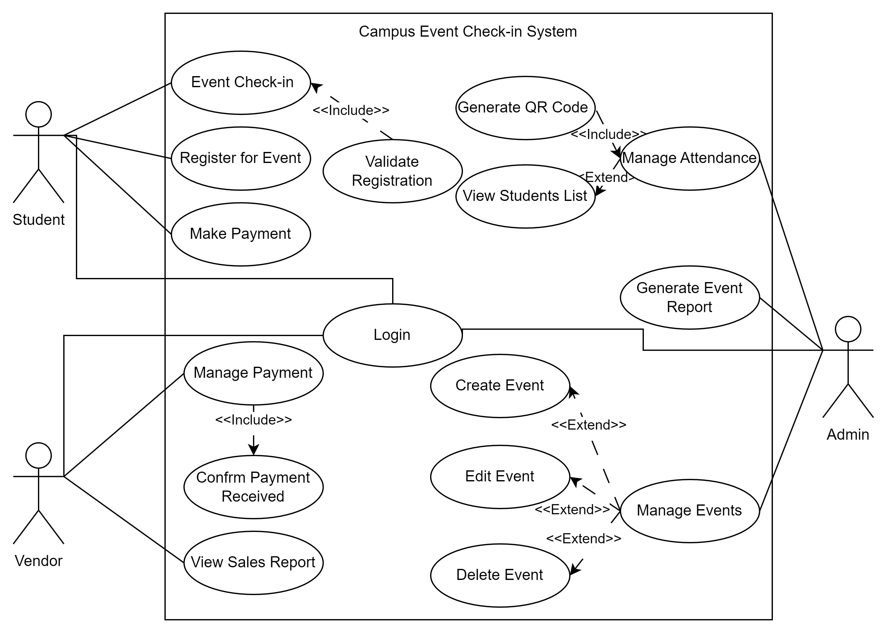

Each use case represents a major system function. The following sub-sections (3.2.2) break down these use cases into detailed functional requirements.

---

### 3.2.2.1 Login

This section defines the functional requirements and [use case specification](#) for the **Login** feature of the system.  
It includes a detailed description of the system behavior, the primary actors involved, and the steps taken during the interaction.  
A sequence diagram is also provided to visually represent the process flow.

#### Functional Requirements

| **Requirement ID** | **Version** | **Description**                                                                 |
|--------------------|-------------|---------------------------------------------------------------------------------|
| FR0001             | 2.0         | The system shall allow users (student, admin, vendor) to log in using their unique credentials. |
| FR0002             | 2.0         | The system shall validate login credentials against the registered database records. |
| FR0003             | 2.0         | The system shall display an error message if invalid credentials are entered.  |
| FR0004             | 2.0         | The system shall prompt the user if required login fields are left empty.      |

**Author:** Suliman

---

#### Use Case Specification – Login

| **Use Case ID**    | UC001                            |
|--------------------|----------------------------------|
| **Version**        | 2.0                              |
| **Feature**        | F001 – Login                     |
| **Purpose**        | To authenticate users before granting access to the system |
| **Actor**          | Student / Admin / Vendor         |
| **Trigger**        | User opens the system and enters login credentials |
| **Precondition**   | User must have a valid account   |
| **Scenario Name**  | Login Process                    |
| **Main Flow**      | 1. User opens the application    2. System displays the login form   3. User enters credentials   4. System checks input format (non-empty, correct format)   5. System verifies credentials against the database   6. If valid, the user is redirected to the correct interface |
| **Alternate Flow – Invalid Credentials** | 5.1 System shows: “Invalid username or password” |
| **Alternate Flow – Empty Fields** | 4.1 System shows: “Please fill in all required fields” |
| **Author**         | Suliman                          |

---

#### Sequence Diagram – Login

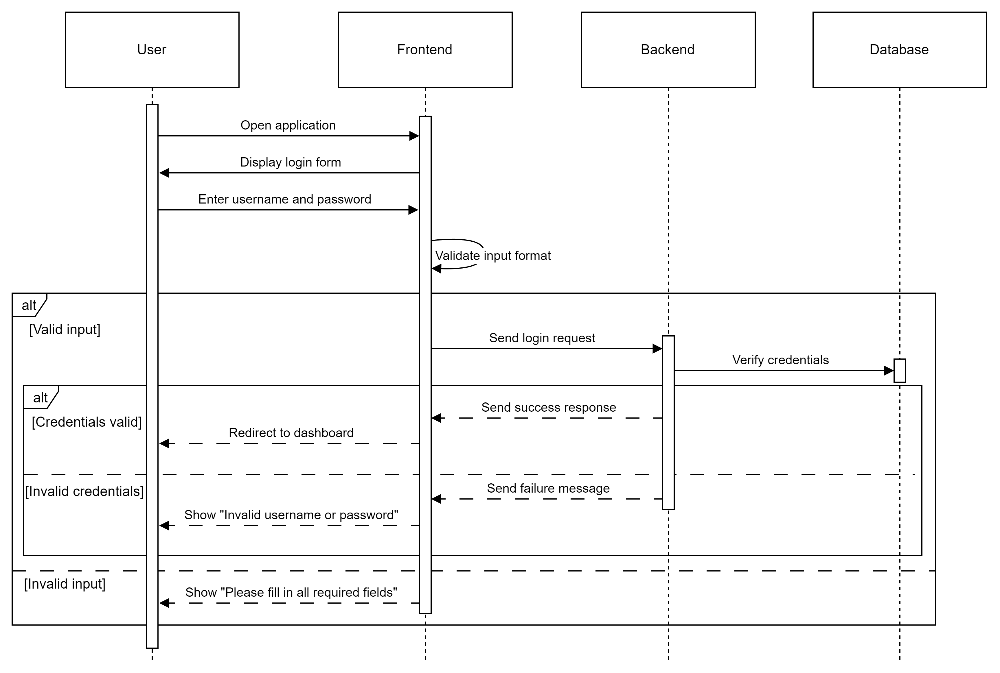

### 3.2.2.2 Event Registration

This section defines the functional requirements and [use case specification](#) for the Event Registration feature of the system.  
It includes a detailed description of the system behavior, the primary actors involved, and the steps taken during the interaction.  
A sequence diagram is also provided to visually represent the process flow.

#### Functional Requirements

| **Requirement ID** | **Version** | **Description**                                                                 |
|--------------------|-------------|---------------------------------------------------------------------------------|
| FR0101             | 2.0         | The system shall allow students to register for available events.              |
| FR0102             | 2.0         | The system shall check ticket availability before proceeding with registration.|
| FR0103             | 2.0         | The system shall process the event registration payment using an integrated payment gateway. |
| FR0104             | 2.0         | The system shall update the student’s registration record upon successful payment. |
| FR0105             | 2.0         | The system shall notify the student of successful registration or payment failure. |

**Author:** Suliman

---

#### Use Case Specification – Event Registration

| **Use Case ID**    | UC002                            |
|--------------------|----------------------------------|
| **Version**        | 2.0                              |
| **Feature**        | F002 – Event Registration        |
| **Purpose**        | To allow students to register for events and complete payment |
| **Actor**          | Student                          |
| **Trigger**        | Student selects an event and initiates registration |
| **Precondition**   | Student must be logged in and the event must have available tickets |
| **Scenario Name**  | Registration Process             |
| **Main Flow**      | 1. Student opens the event list   2. Student selects an event to register for   3. System checks ticket availability   4. System prompts for payment   5. Student completes payment   6. System verifies payment   7. System updates registration record   8. Student receives confirmation |
| **Alternate Flow – Tickets Unavailable** | 3.1 System shows: “Tickets are sold out” |
| **Alternate Flow – Payment Failed** | 6.1 System shows: “Payment unsuccessful. Please try again.” |
| **Author**         | Suliman                          |

---

#### Sequence Diagram – Event Registration

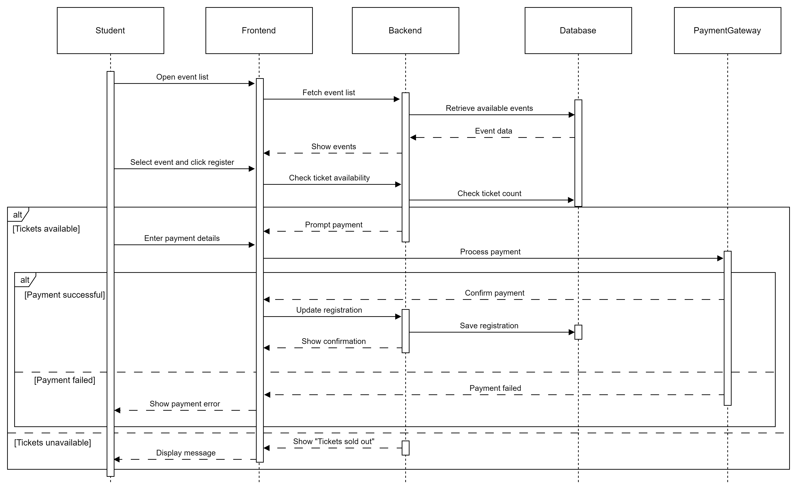

### 3.2.2.3 Event Check-In

This section defines the functional requirements and [use case specification](#) for the Event Check-In feature of the system.  
It includes a detailed description of the system behavior, the primary actors involved, and the steps taken during the interaction.  
A sequence diagram is also provided to visually represent the process flow.

#### Functional Requirements

| **Requirement ID** | **Version** | **Description**                                                                          |
|--------------------|-------------|------------------------------------------------------------------------------------------|
| FR0301             | 2.0         | The system shall allow students to check in to events for which they are registered.     |
| FR0302             | 2.0         | The system shall verify the student’s registration and identity during check-in.         |
| FR0303             | 2.0         | The system shall mark the student as checked in and log the check-in time.              |
| FR0304             | 2.0         | The system shall prevent check-in for students who are not registered.                  |

**Author:** Suliman

---

#### Use Case Specification – Event Check-In

| **Use Case ID**    | UC003                            |
|--------------------|----------------------------------|
| **Version**        | 2.0                              |
| **Feature**        | F003 – Event Check-In            |
| **Purpose**        | To allow students to check in at the event using their registration and identity |
| **Actor**          | Student                          |
| **Trigger**        | Student scans a QR code at the event venue |
| **Precondition**   | Student must be registered for the event and have a valid ticket |
| **Scenario Name**  | Event Check-In Process           |
| **Main Flow**      | 1. Student arrives at the event venue   2. Student scans the QR code displayed at the check-in point   3. System verifies student registration and identity   4. If verification succeeds, the system logs check-in and records the timestamp   5. Student is allowed to enter the event |
| **Alternate Flow – Not Registered** | 3.1 System shows: “You are not registered for this event” |
| **Author**         | Suliman                          |

---

#### Sequence Diagram – Event Check-In

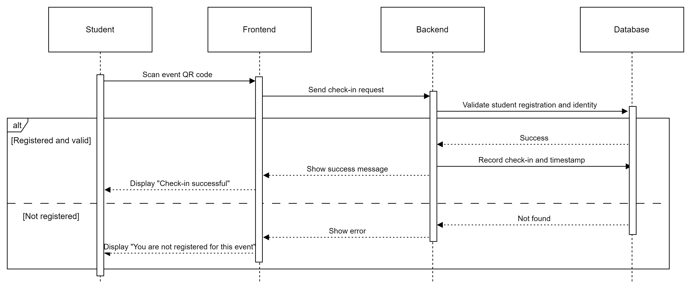

### 3.2.2.4 Make Payment

This section defines the functional requirements and [use case specification](#) for the **Make Payment** feature of the system.

In earlier versions of the SRS, this was referred to as **Process Student Payment**, primarily intended for handling payments related to event registration. However, this is now handled as part of the **Event Registration** use case.

The **Make Payment** feature now focuses only on **on-site vendor payments**, such as food or merchandise during events.

#### Functional Requirements

| **Requirement ID** | FR0401 |
|--------------------|--------|
| **Version**        | 2.0    |
| **Description**    | The system shall allow students to initiate payments for purchases made at event venues. |
| **Author**         | Lim Ai Nee |

---

| **Requirement ID** | FR0402 |
|--------------------|--------|
| **Version**        | 2.0    |
| **Description**    | The system shall process the payment via an integrated payment gateway. |
| **Author**         | Lim Ai Nee |

---

| **Requirement ID** | FR0403 |
|--------------------|--------|
| **Version**        | 2.0    |
| **Description**    | The system shall update the payment database upon successful transaction. |
| **Author**         | Lim Ai Nee |

---

| **Requirement ID** | FR0404 |
|--------------------|--------|
| **Version**        | 2.0    |
| **Description**    | The system shall notify students of successful or failed payment status. |
| **Author**         | Lim Ai Nee |

---

#### Use Case Specification – Make Payment

| **Use Case ID**    | UC004                            |
|--------------------|----------------------------------|
| **Version**        | 2.0                              |
| **Feature**        | F004 – Make Payment              |
| **Purpose**        | To allow students to make payments to vendors during events |
| **Actor**          | Student                          |
| **Trigger**        | Student selects a vendor or scans a vendor’s QR code to initiate payment |
| **Precondition**   | Student must be logged in and have a valid payment method |
| **Main Flow**      | 1. Student scans vendor QR code or selects vendor   2. System prompts for payment details   3. Student enters payment amount and confirms   4. System processes the payment via the gateway   5. If payment is successful, the database is updated and student is notified |
| **Alternate Flow – Payment Failed** | 5.1 System displays: “Payment failed. Please try again.” |
| **Author**         | Lim Ai Nee                        |

---

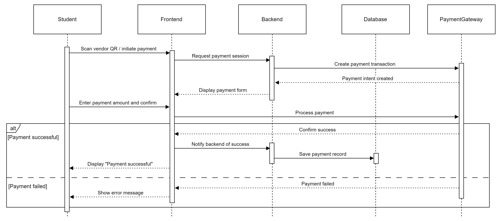

---

### 3.2.2.5 Manage Event

This section defines the functional requirements and [use case specification](#) for the **Manage Event** feature.

This includes actions such as **Create**, **Edit**, and **Delete Event**, now modeled as extensions under the admin’s event management functionality.

#### Functional Requirements

| **Requirement ID** | FR0501 |
|--------------------|--------|
| **Version**        | 2.0    |
| **Description**    | The system shall allow admins to access an event management interface. |
| **Author**         | Lim Ai Nee |

---

| **Requirement ID** | FR0502 |
|--------------------|--------|
| **Version**        | 2.0    |
| **Description**    | The system shall allow admins to create new events by entering required details. |
| **Author**         | Lim Ai Nee |

---

| **Requirement ID** | FR0503 |
|--------------------|--------|
| **Version**        | 2.0    |
| **Description**    | The system shall allow admins to modify existing events. |
| **Author**         | Lim Ai Nee |

---

| **Requirement ID** | FR0504 |
|--------------------|--------|
| **Version**        | 2.0    |
| **Description**    | The system shall allow admins to delete events that are no longer needed. |
| **Author**         | Lim Ai Nee |

---

| **Requirement ID** | FR0505 |
|--------------------|--------|
| **Version**        | 2.0    |
| **Description**    | The system shall validate event details before saving changes. |
| **Author**         | Lim Ai Nee |

---

| **Requirement ID** | FR0506 |
|--------------------|--------|
| **Version**        | 2.0    |
| **Description**    | The system shall update the event records in the database after each operation. |
| **Author**         | Lim Ai Nee |

---

#### Use Case Specification – Manage Event

| **Use Case ID**    | UC005                            |
|--------------------|----------------------------------|
| **Version**        | 2.0                              |
| **Feature**        | F005 – Manage Events             |
| **Purpose**        | To enable admins to create, edit, or delete event records |
| **Actor**          | Admin                            |
| **Trigger**        | Admin opens the event management interface |
| **Precondition**   | Admin must be logged in with event management permissions |
| **Main Flow**      | 1. Admin navigates to the event management section   2. System displays a list of existing events   3. Admin selects one of the following actions:   • Create new event   • Edit an existing event   • Delete an event   4. System displays the relevant form or confirmation prompt   5. Admin submits the action   6. System validates input and saves changes to the database   7. System displays a success message |
| **Alternate Flow – Cancelled Action** | 4.1 Admin cancels the action → return to event list |
| **Alternate Flow – Invalid Input**    | 6.1 System displays: “Please fill in all required fields” |
| **Author**         | Lim Ai Nee                        |

---

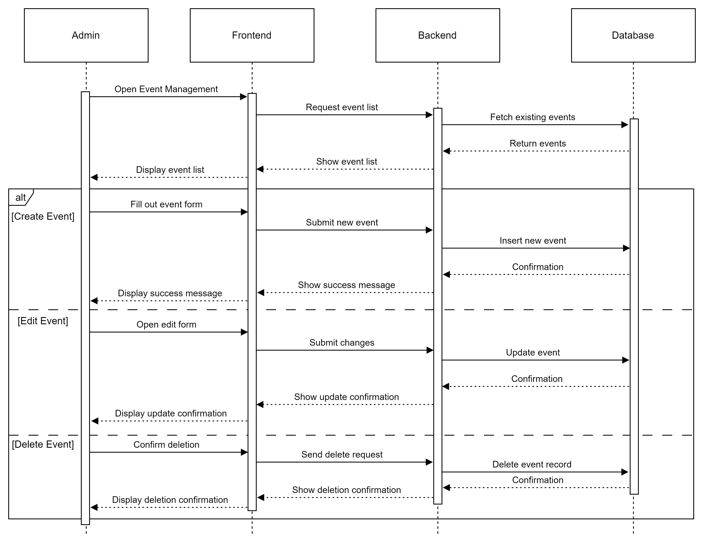

### 3.2.2.6 Manage Attendance

This section defines the functional requirements and [use case specification](#) for the **Manage Attendance** feature.

In this improved version, the feature is split into two interactions: **QR code generation** and **attendance list retrieval**, using real-time data integration.

#### Functional Requirements

| **Requirement ID** | FR0601 |
|--------------------|--------|
| **Version**        | 2.0    |
| **Description**    | The system shall allow admins to generate a unique QR code for event check-in. |
| **Author**         | Azhar  |

---

| **Requirement ID** | FR0602 |
|--------------------|--------|
| **Version**        | 2.0    |
| **Description**    | The system shall retrieve check-in logs of students for a selected event. |
| **Author**         | Azhar  |

---

| **Requirement ID** | FR0603 |
|--------------------|--------|
| **Version**        | 2.0    |
| **Description**    | The system shall retrieve student details associated with each check-in record. |
| **Author**         | Azhar  |

---

| **Requirement ID** | FR0604 |
|--------------------|--------|
| **Version**        | 2.0    |
| **Description**    | The system shall display the list of students who have checked in, along with their basic information. |
| **Author**         | Azhar  |

---

#### Use Case Specification – Manage Attendance

| **Use Case ID**    | UC006                            |
|--------------------|----------------------------------|
| **Version**        | 2.0                              |
| **Feature**        | F006 – Manage Attendance         |
| **Purpose**        | To enable admins to manage student attendance during events by generating check-in QR codes and reviewing attendance records |
| **Actor**          | Admin                            |
| **Trigger**        | Admin accesses the attendance management interface |
| **Precondition**   | Admin must be logged in and have access to an active event |
| **Main Flow**      | 1. Admin opens the attendance management tab   2. Selects an event   3. System generates a unique QR code for check-in   4. Admin displays the QR code at the event   5. Admin requests the attendance list   6. System retrieves check-in logs from the event database   7. System retrieves student details from the student database   8. System displays the full list of attendees with names and check-in timestamps |
| **Alternate Flow – No Check-ins Yet** | 6.1 System displays: “No students have checked in yet” |
| **Author**         | Azhar                            |

---

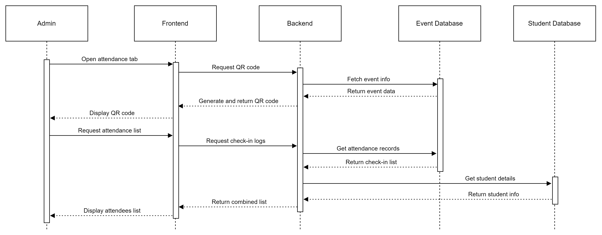

---

### 3.2.2.7 Manage Payment (Vendor)

This section defines the functional requirements and [use case specification](#) for the **Manage Payment** feature used by vendors.

This updated version supports real-time entry, backend logging, and transaction confirmation.

#### Functional Requirements

| **Requirement ID** | FR0701 |
|--------------------|--------|
| **Version**        | 2.0    |
| **Description**    | The system shall allow vendors to input payment amounts during transactions. |
| **Author**         | Azhar  |

---

| **Requirement ID** | FR0702 |
|--------------------|--------|
| **Version**        | 2.0    |
| **Description**    | The system shall process and record each payment in the payment database. |
| **Author**         | Azhar  |

---

| **Requirement ID** | FR0703 |
|--------------------|--------|
| **Version**        | 2.0    |
| **Description**    | The system shall confirm that a transaction has been saved before updating the interface. |
| **Author**         | Azhar  |

---

| **Requirement ID** | FR0704 |
|--------------------|--------|
| **Version**        | 2.0    |
| **Description**    | The system shall allow vendors to mark a sale as complete and begin a new transaction. |
| **Author**         | Azhar  |

---

| **Requirement ID** | FR0705 |
|--------------------|--------|
| **Version**        | 2.0    |
| **Description**    | The system shall display an error message if the entered amount field is empty or invalid. |
| **Author**         | Azhar  |

---

#### Use Case Specification – Vendor Payment Management

| **Use Case ID**    | UC007                            |
|--------------------|----------------------------------|
| **Version**        | 2.0                              |
| **Feature**        | F007 – Vendor Payment Management |
| **Purpose**        | To enable vendors to manage on-site payments during events |
| **Actor**          | Vendor                           |
| **Trigger**        | Vendor opens the in-app payment interface |
| **Precondition**   | Vendor must be logged in and registered to the event |
| **Main Flow**      | 1. Vendor opens the vendor dashboard   2. Vendor clicks "Start New Sale"   3. Vendor enters the total amount to be paid   4. System records the transaction in the payment database   5. System confirms and updates the dashboard with the new payment entry   6. Vendor can start another transaction |
| **Alternate Flow – Invalid/Empty Field** | 3.1 System displays: “Please enter a valid amount” |
| **Author**         | Azhar                            |

---

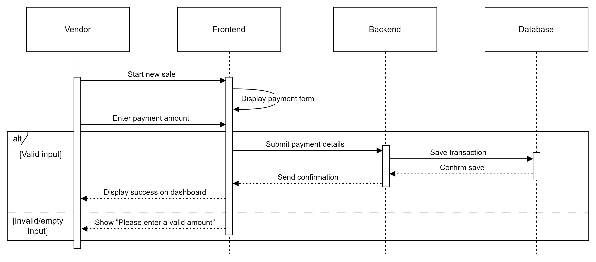

### 3.2.2.8 View Sales Report

This section defines the functional requirements and [use case specification](#) for the **View Sales Report** feature for vendors. It now explicitly reflects backend interaction and error handling for missing data.

#### Functional Requirements

| **Requirement ID** | FR0801 |
|--------------------|--------|
| **Version**        | 2.0    |
| **Description**    | The system shall allow vendors to request a sales report based on a defined period. |
| **Author**         | Yousef |

---

| **Requirement ID** | FR0802 |
|--------------------|--------|
| **Version**        | 2.0    |
| **Description**    | The system shall retrieve the vendor’s sales data from the database. |
| **Author**         | Yousef |

---

| **Requirement ID** | FR0803 |
|--------------------|--------|
| **Version**        | 2.0    |
| **Description**    | The system shall generate a structured report based on retrieved sales records. |
| **Author**         | Yousef |

---

| **Requirement ID** | FR0804 |
|--------------------|--------|
| **Version**        | 2.0    |
| **Description**    | The system shall display the report to the vendor in a readable format. |
| **Author**         | Yousef |

---

| **Requirement ID** | FR0805 |
|--------------------|--------|
| **Version**        | 2.0    |
| **Description**    | The system shall show an appropriate message if no sales data is found for the selected period. |
| **Author**         | Yousef |

---

#### Use Case Specification – View Sales Report

| **Use Case ID**    | UC008                            |
|--------------------|----------------------------------|
| **Version**        | 2.0                              |
| **Feature**        | F008 – View Sales Report         |
| **Purpose**        | To enable vendors to view and analyze their sales activity for a specific date range |
| **Actor**          | Vendor                           |
| **Trigger**        | Vendor initiates a sales report request from the dashboard |
| **Precondition**   | Vendor must be logged in and have recorded transactions |
| **Main Flow**      | 1. Vendor opens the report section from the dashboard   2. Vendor selects a date range and clicks “Generate Report”   3. System retrieves relevant sales data from the database   4. System generates and formats the report   5. System displays the report to the vendor |
| **Alternate Flow – No Sales Found** | 3.1 System displays: “No sales data available for the selected period” |
| **Author**         | Yousef                            |

---

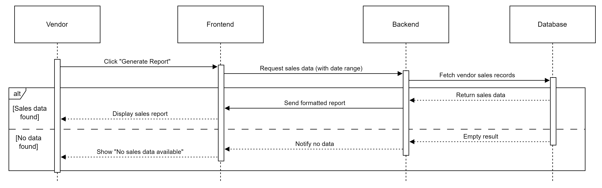

---

### 3.2.2.9 Generate Event Report

This section defines the functional requirements and [use case specification](#) for the **Generate Event Report** feature.

This is the first dedicated version of this functionality, now modeled as its own use case for clarity and backend integration.

#### Functional Requirements

| **Requirement ID** | FR0901 |
|--------------------|--------|
| **Version**        | 1.0    |
| **Description**    | The system shall allow admins to generate reports for specific events. |
| **Author**         | Yousef |

---

| **Requirement ID** | FR0902 |
|--------------------|--------|
| **Version**        | 1.0    |
| **Description**    | The system shall retrieve all relevant attendance and transaction data from the database. |
| **Author**         | Yousef |

---

| **Requirement ID** | FR0903 |
|--------------------|--------|
| **Version**        | 1.0    |
| **Description**    | The system shall compile the data into a readable and exportable format. |
| **Author**         | Yousef |

---

| **Requirement ID** | FR0904 |
|--------------------|--------|
| **Version**        | 1.0    |
| **Description**    | The system shall allow the admin to view and optionally download the report. |
| **Author**         | Yousef |

---

| **Requirement ID** | FR0905 |
|--------------------|--------|
| **Version**        | 1.0    |
| **Description**    | The system shall notify the admin if no data is available for the selected event. |
| **Author**         | Yousef |

---

#### Use Case Specification – Generate Event Report

| **Use Case ID**    | UC009                             |
|--------------------|-----------------------------------|
| **Version**        | 1.0                               |
| **Feature**        | F009 – Generate Event Report      |
| **Purpose**        | To allow admins to generate and access post-event reports including attendance and sales data |
| **Actor**          | Admin                             |
| **Trigger**        | Admin accesses the report section and selects an event |
| **Precondition**   | Admin must be logged in and the selected event must have at least one data record (attendance or transaction) |
| **Main Flow**      | 1. Admin opens the reporting interface   2. Admin selects an event to generate a report for   3. System retrieves attendance and sales data related to that event   4. System formats and compiles the report   5. System displays the report and allows optional download |
| **Alternate Flow – No Data** | 3.1 System displays: “No reportable data available for this event” |
| **Author**         | Yousef                             |

---

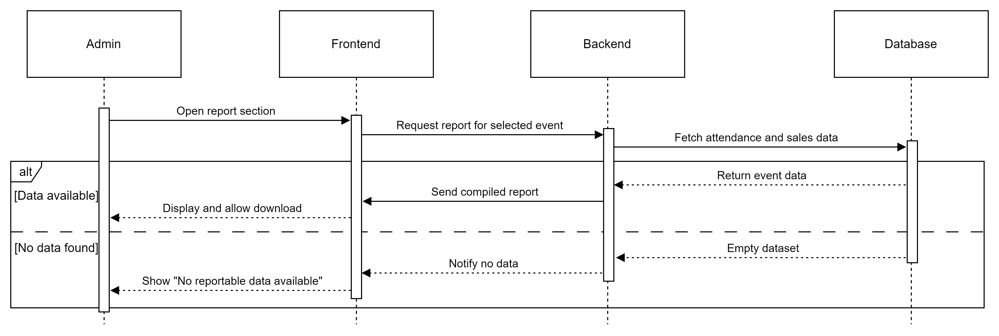

## IMPORTANT *Suliman: THIS PART SHOULD BE MOVED UP WHILE COMBINING ALL THE WORK*

### 1.3.1.1 System Interface

| Requirement ID | Description | Priority | Author |
|----------------|-------------|----------|--------|
| REQ_SI001 | The system must be linked to the university’s student database via an authenticated API or secure connection to validate student identity in real-time. | High | Suliman |
| REQ_SI002 | The system will integrate with Stripe, a PCI-compliant digital payment service, to allow vendors to process purchases using debit, credit, or e-wallets. | High | Suliman |
| REQ_SI003 | Admin interfaces must connect to the centralized backend to retrieve and update data related to events, tickets, and attendance. | Medium | Suliman |
| REQ_SI004 | All check-ins, purchases, and admin actions will be logged securely. | High | Suliman |

### 1.3.1.2 User Interface

| Interface ID | Description | Priority | Author |
|--------------|-------------|----------|--------|
| REQ_UI001 | The system shall offer a responsive design that adjusts to different screen sizes and devices. | High | Suliman |
| REQ_UI002 | Interfaces must maintain consistency in layout, colors, icons, and interaction patterns to support usability. | High | Suliman |
| REQ_UI003 | Navigation must be simple and intuitive, allowing users to complete tasks with minimal steps. | High | Suliman |
| REQ_UI004 | All forms shall provide real-time validation feedback, including helpful error messages for incorrect input. | Medium | Suliman |
| REQ_UI005 | Visual feedback (e.g., success, loading, or failure indicators) must be provided for all user actions. | Medium | Suliman |
| REQ_UI006 | Text fields, buttons, tables, and other components must be clearly labeled and accessible. | High | Suliman |
| REQ_UI007 | QR code-based interactions (for check-in and vendor payments) must be integrated seamlessly into the mobile interface. | High | Suliman |
| REQ_UI008 | The UI must be accessible, supporting standard keyboard navigation and readable contrast ratios. | High | Suliman |
| REQ_UI009 | The system should allow for language localization in future versions to support multilingual users. | Low | Suliman |

### 1.3.1.3 Hardware Interface

| Interface ID | Description | Priority | Author |
|--------------|-------------|----------|--------|
| REQ_HW001 | Student devices must be smartphones (Android/iOS) equipped with cameras to enable QR scanning at event check-in. | High | Suliman |
| REQ_HW002 | Student devices must be internet-enabled, supporting either Wi-Fi or mobile data connections. | High | Suliman |
| REQ_HW003 | The app will access the camera for QR scanning functionality on student devices. | High | Suliman |
| REQ_HW004 | Vendor devices must be smartphones or tablets capable of managing sales and logging payments. | High | Suliman |
| REQ_HW005 | Vendor devices must have reliable internet connectivity to ensure real-time transaction logging. | High | Suliman |
| REQ_HW006 | Admins will use laptops or desktops to manage events, generate reports, and control attendance. | High | Suliman |
| REQ_HW007 | Admin devices must support standard web browsers and secure system access protocols. | High | Suliman |
| REQ_HW008 | Admins may use tablets or laptops to display QR codes for check-in purposes. | Medium | Suliman |
| REQ_HW009 | QR code display devices should have high-resolution displays to ensure easy and accurate scanning. | Medium | Suliman |
| REQ_HW010 | The backend system must be hosted on a university-managed server infrastructure. | High | Suliman |
| REQ_HW011 | All client-server communications must be secured using HTTPS with TLS encryption. | High | Suliman |

### 1.3.1.4 Software Interface

| Interface ID | Description | Priority | Author |
|--------------|-------------|----------|--------|
| REQ_SW001 | The system shall connect to the university’s student information system via a hosted API to verify credentials during login and check-in. | High | Suliman |
| REQ_SW002 | The system shall integrate with Stripe as a payment gateway to manage payment sessions, confirm transactions, and verify payment success. | High | Suliman |
| REQ_SW003 | Communication with Stripe shall occur over HTTPS, with API keys securely stored in the backend system. | High | Suliman |
| REQ_SW004 | The system shall use the `qr_flutter` library or an equivalent package to generate dynamic QR codes for each event. | Medium | Suliman |
| REQ_SW005 | Generated QR codes shall include encrypted event IDs and be displayed in real-time during check-in. | High | Suliman |
| REQ_SW006 | The system shall utilize the Elastic Stack (Elasticsearch, Logstash, Kibana) for backend logging of check-ins, transactions, and admin activities. | Medium | Suliman |
| REQ_SW007 | All logs shall be pushed to Logstash and visualized through Kibana dashboards for monitoring and analysis. | Medium | Suliman |

### 1.3.1.5 Communication Interfaces

| Interface ID | Description | Priority | Author |
|--------------|-------------|----------|--------|
| REQ_COM001 | Communication with the student database shall use HTTPS over a REST API to securely validate student records during login and check-in. | High | Suliman |
| REQ_COM002 | Payment transactions shall be transmitted securely using HTTPS with TLS encryption between student devices and the Stripe system. | High | Suliman |
| REQ_COM003 | Internal system communications, including QR code generation, event syncing, and logging, shall use HTTPS to ensure secure operations. | High | Suliman |
| REQ_COM004 | All frontend interfaces for students, vendors, and admins shall communicate with the backend over HTTPS via web-based protocols to ensure secure and encrypted interactions. | High | Suliman |

### 3.3 Performance Requirements

| Requirement ID | Description | Priority | Author |
|----------------|-------------|----------|--------|
| REQ_P001 | The system must support up to 300 concurrent users without any noticeable performance degradation. | High | Lim Ai Nee |
| REQ_P002 | Check-in validation and ticket verification must complete in under 5 seconds. | High | Lim Ai Nee |
| REQ_P003 | All on-site transactions (e.g., purchases from vendors) must be processed accurately and efficiently. | High | Lim Ai Nee |
| REQ_P004 | Upon successful registration, the event ticket confirmation should be issued within 10 seconds of form submission. | Medium | Lim Ai Nee |
| REQ_P005 | The system must scale to support up to 3,000 total users, maintaining stability and preventing data loss. | Medium | Lim Ai Nee |
| REQ_P006 | Any changes made by admins (such as event updates or ticket changes) must synchronize across all devices. | Medium | Lim Ai Nee |

### 3.4 Usability Requirements

| Requirement ID | Description | Priority | Author |
|----------------|-------------|----------|--------|
| REQ_UR001 | The system must deliver a user-friendly interface accessible on both web and mobile platforms. | High | Lim Ai Nee |
| REQ_UR002 | All users (students, vendors, and admins) must be able to complete their tasks (e.g., check-in, view sales, register for events) without confusion or error. | Medium | Lim Ai Nee |
| REQ_UR003 | The user interface should maintain readable fonts, well-organized layouts, and support keyboard navigation to ensure accessibility. | High | Lim Ai Nee |
| REQ_UR004 | Error messages must be clear and informative, providing users with the guidance to recover from errors independently. | High | Lim Ai Nee |
